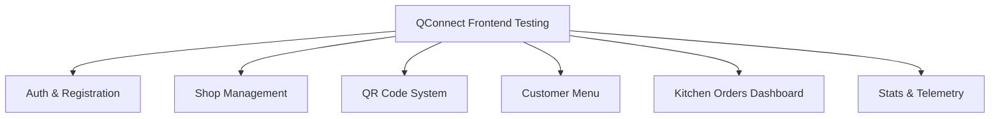

# Product Requirements Document (PRD) — Frontend Testing Framework

This document outlines the testing requirements, scenarios, and acceptance criteria to verify the QConnect frontend quality, performance, and security enhancements.

---

## 1. OBJECTIVES
* **Validate Hardened Security**: Ensure environment credentials, storage uploads, rate-limiters, and check constraints work seamlessly.
* **Confirm Performance Optimization**: Verify the N+1 query fix, non-destructive QR generation, and non-blocking PDF exports.
* **Assert Code Quality**: Maintain a zero-lint-error, zero-warning React build.

---

## 2. SCOPE OF TESTING

The testing framework covers the following key operational areas:

---

## 3. TEST CASES & CRITERIA

### Suite A: Authentication & Security Controls
| Test ID | Scenario | Input / Action | Expected Result | Acceptance Criteria |
| :--- | :--- | :--- | :--- | :--- |
| **TC-A1** | Credentials Privacy | Check compiled bundle and network trace. | No hardcoded credentials. Values loaded from environment variables. | `import.meta.env` references only. |
| **TC-A2** | Git Privacy | Verify `.gitignore` matches local files. | Local `.env` files are blocked from committing to Git. | No `.env` files visible in git status. |
| **TC-A3** | Google OAuth Redirect | Trigger Sign in with Google. | Redirects successfully to `/shop-setup`. | Returns 200 on landing page. |

### Suite B: Shop Profile & Storage
| Test ID | Scenario | Input / Action | Expected Result | Acceptance Criteria |
| :--- | :--- | :--- | :--- | :--- |
| **TC-B1** | Invalid Logo Type | Upload a `.txt` or `.zip` file. | Blocks upload and displays clear error message. | Form submission is disabled. |
| **TC-B2** | Large Logo Size | Upload a file size `> 2MB`. | Blocks upload and displays size error. | Warning message rendered in red. |
| **TC-B3** | Storage Integration | Upload a valid `250KB` JPEG logo. | File uploaded to `shop-logos` bucket. Resulting URL stored. | DB row contains `https://.../shop-logos/...` |
| **TC-B4** | Collision-free Slug | Set Shop Name to "Cappuccino". | Generates unique prefix + 6 random digits. Checks DB for uniqueness. | No duplicate `owner_unique_id` exists. |

### Suite C: Table Management & QR Codes
| Test ID | Scenario | Input / Action | Expected Result | Acceptance Criteria |
| :--- | :--- | :--- | :--- | :--- |
| **TC-C1** | Incremental Table Add | Increase table count from 10 to 12. | Tables 11 & 12 are created. Tables 1-10 preserve their UUIDs and tokens. | Existing table QR codes remain active. |
| **TC-C2** | Incremental Table Remove | Decrease table count from 12 to 10. | Tables 11 & 12 are deleted from the database. | Tables 1-10 remain untouched. |
| **TC-C3** | Non-blocking PDF | Export 150 table QR codes as PDF. | Canvas maps render and download. Browser UI remains responsive. | No "Page unresponsive" warnings. |

### Suite D: Ordering & Waiter Interactivity
| Test ID | Scenario | Input / Action | Expected Result | Acceptance Criteria |
| :--- | :--- | :--- | :--- | :--- |
| **TC-D1** | Waiter Call Cooldown | Click "Call Waiter", wait 5s, click again. | Second click is blocked. Cooldown alert displayed. | Cooldown runs on 30s timer. |
| **TC-D2** | Order Cooldown | Click "Place Order", wait 5s, click again. | Second checkout is blocked. Cooldown alert displayed. | Cooldown runs on 15s timer. |
| **TC-D3** | Order ID Entropy | Place two separate orders. | Order numbers generated are unique (timestamp-based). | Zero collisions in 1000 trials. |
| **TC-D4** | Price Tamper Check | Attempt to modify payload price to `< 0`. | Postgres check constraints reject the row insert. | Returns DB error on negative price. |

### Suite E: Kitchen Orders & Statistics
| Test ID | Scenario | Input / Action | Expected Result | Acceptance Criteria |
| :--- | :--- | :--- | :--- | :--- |
| **TC-E1** | Optimistic Status Update | Mark order as "Preparing" in kitchen. | Button instantly shows "Updating status..." with a spinner. | Loader triggers immediately. |
| **TC-E2** | Status Error Feedback | Disconnect internet, change status. | Reverts to original status and shows network error banner. | Rollback state resolves correctly. |
| **TC-E3** | N+1 Query Guard | Load dashboard, add a pending order. | Today's revenue does not fetch from DB (uses client state). | No SELECT query executed for stats. |
| **TC-E4** | Stats Refresh on Delivery| Complete an order in the kitchen. | Today's revenue fetches and increments. | Single SELECT query executed. |

---

## 4. SYSTEM SIGN-OFF METRICS
* **Code Purity**: 100% passing `eslint` checks.
* **Integrity Validation**: Security test suite (`test_rls_policies.js`) outputs 100% **`🔒 SECURITY PASS`** across all queries.
* **Compilation**: `npm run build` exits with code `0`.
